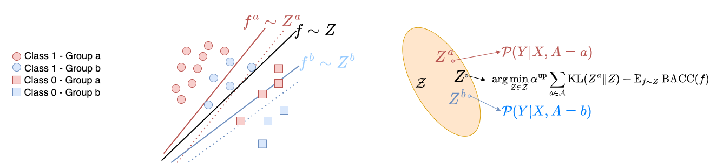
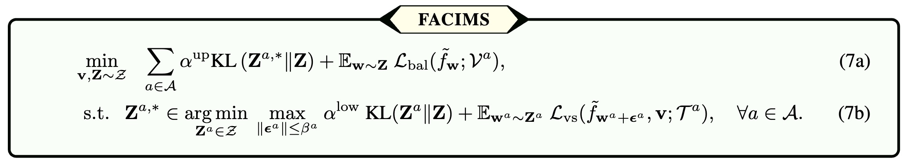

# Fairness-Aware Class Imbalanced Learning on Multiple Subgroups

This repository holds the official code for the paper [Fairness-Aware Class Imbalanced 
Learning on Multiple Subgroups]() (Accepted by [UAI 2023](https://www.auai.org/uai2023/))  

### 🦸‍ Abstract
We propose a novel Bayesian-based optimization framework designed to tackle the challenge of generalization in overparameterized models with imbalanced subgroups and limited samples. Our proposed tri-level optimization framework leverages both local (subgroup-specific) predictors, trained on a small amount of data, and a fair and class-balanced predictor at the middle and lower levels. To effectively overcome saddle points for minority classes, our lower-level formulation incorporates sharpness-aware minimization. At the upper level, the framework dynamically adjusts the loss function based on validation loss, ensuring close alignment between the global predictor and local predictors. Theoretical analysis demonstrates the framework's ability to enhance classification and fairness generalization, potentially leading to improvements in the generalization bound. Empirical results validate the superior performance of our tri-level framework compared to existing state-of-the-art approaches.

### 💡 Method

This figure illusrates the mechanism of our framework. In this figure, $f^a$ and $f^b$ maximize the margin for minority classes for groups $a$ and $b$. In the upper level problem FACIMS finds $\mathbf{Z}\in\mathcal{Z}$ to achieve a small balanced accuracy while minimizing the discrepancy between $(\mathbf{Z}^{a,\star},\mathbf{Z}^{b,\star})$. The approximation term $\text{KL}(\mathbf{Z}^{a,\star}| \mathbf{Z})$ is based on the distribution family $\mathcal{Z}$ (orange region). If the predefined $\mathcal{Z}$ has good expressive power, the approximation is treated as a small constant.

Our objective is specified as follows:



### 🗄️ Data
In our paper, we use three real-world datasets listed as follows. We only provide the data 
resources for Credit and Drug. Alzheimer’s Disease dataset needs credentials. For its usage, please refer to https://adni.loni.usc.edu/.
  - Alzheimer’s Disease: This dataset is obtained from the Alzheimer's Disease Neuroimaging Initiative (ADNI) database. We included 5137 instances, including 4080 mild cognitive impairment (MCI, a prodromal stage of AD) and 1057 AD instances, to conduct the binary classification. Moreover, we chose race as the sensitive feature and divided the participants into four subgroups, where white subjects exceeding 90\%. Our features included 17 AD-related biomarkers, including cognitive scores, volumes of brain regions extracted from the magnetic resonance imaging (MRI) scans, amyloid and tau measurements from positron emission tomography (PET) scans and cerebrospinal fluid (CSF), and risk factors like APOE4 carriers and age.
  - Credit Card: This dataset contains 22 attributes like clients' basic information, history of payments, and bill statement amount to classify whether the clients are credible or not. We included 30000 instances with 6636 credible and 23365 not credible clients. We chose the education level as the sensitive feature where we observed more clients who graduated from university than other six levels.
  - Drug Consumption: This dataset contains demographic information such as age, gender, and education level, as well as measures of personality traits thought to influence drug use for 1885 respondents. The task is to predict alcohol use with K = 4 categories (never used, not used in the past year, used in the past year, and used in the past day) for multi-class outcomes. The sensitive feature is education level (Left school before or at 16, Left school at 17-18, Some college, Certificate diploma, university degree, Masters, Doctorate ). The data information is summarized in Table 1 below. As can be seen, the class distribution shows that the dataset suffers from heavy label imbalance.


### 📝 Requirements
The algorithm is implemented mainly based on PyTorch deep learning framework. 
To install the related packages, use
```bash
pip install -r requirements.txt
```

### 🔨 Usage

1. Use our provided data files and Make Sure that there are well-prepared representative data in the `./DATASOURCE/#your_dataset` folder.

2. Use `all_train.py` script to train your model.
   1. Use config file in `./EXPS` to train your model.

        ```cmd
        python all_train.py -config EXPS/credit_template.yml
        ```

        We have provided our template configs on *credit card* and *drug consumption* datasets.

   2. Directly passing the changeable parameters to the training script as:

        ```cmd
        python all_train.py --method ours --dataset credit --N_subtask 10
        ```

    Note: The config file has higher priority than the direct passed params.

3. Check the result:

   1. Log file will be output to `./logs` folder
   2. Numerical test result will be saved to `./npy` folder  


### 🤝 Acknowledgements
This work was supported in part by the NIH grants U01 AG066833, RF1 AG063481, U01 AG068057, R01 LM013463 P30 AG073105, and U01 CA274576, and the NSF grant IIS 1837964. Data used in this study were obtained from the Alzheimer's Disease Neuroimaging Initiative database (\url{adni.loni.usc.edu}), which was funded by NIH U01 AG024904. The authors Davoud Ataee Tarzanagh, Bojian Hou and Boning Tong  have contributed equally to this paper.


### 📭 Maintainers

[Bojian Hou](http://bojianhou.com) 
- ([bojian.hou@pennmedicine.upenn.edu](mailto:bojian.hou@pennmedicine.upenn.edu))
- ([hobo.hbj@gmail.com](mailto:hobo.hbj@gmail.com))

### 📚 Citation

```
@inproceedings{TH2023fairness,
  title={Fairness-aware class imbalanced learning on multiple subgroups},
  author={Tarzanagh, Davoud Ataee and Hou, Bojian and Tong, Boning and Long, Qi and Shen, Li},
  booktitle={Uncertainty in Artificial Intelligence},
  pages={2123--2133},
  year={2023},
  organization={PMLR}
}
```


   