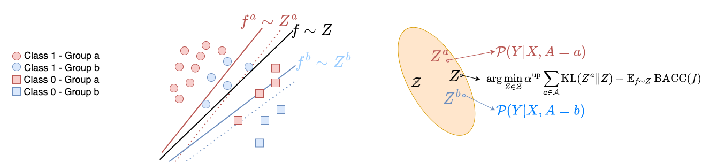

# Fairness-Aware Class Imbalanced Learning on Multiple Subgroups

This repository holds the official code for the paper [Fairness-Aware Class Imbalanced 
Learning on Multiple Subgroups]() (Accepted by [UAI 2023](https://www.auai.org/uai2023/))  

### 🦸‍ Abstract
We propose a novel Bayesian-based optimization framework designed to tackle the challenge 
of generalization in overparameterized models with imbalanced subgroups and limited samples. 
Our proposed tri-level optimization framework leverages both local (subgroup-specific) predictors, 
trained on a small amount of data, and a fair and class-balanced predictor at the middle 
and lower levels. To effectively overcome saddle points for minority classes, our lower-level 
formulation incorporates sharpness-aware minimization. At the upper level, the framework 
dynamically adjusts the loss function based on validation loss, ensuring close alignment 
between the global predictor and local predictors. Theoretical analysis demonstrates the 
framework's ability to enhance classification and fairness generalization, potentially 
leading to improvements in the generalization bound. Empirical results validate the superior 
performance of our tri-level framework compared to existing state-of-the-art approaches.
### 🗄️ Data
We use three real-world datasets listed as follows. 
  - Alzheimer’s Disease (Tadpole)
  - Credit Card (Credit)
  - Drug
   

### 💡 Method



### 📝 Requirements
The algorithm is implemented mainly based on PyTorch Deep Learning Framework. 
To install the related packages, use
```bash
pip install -r requirements.txt
```

### 🔨 Usage

1. Use our provided data files and Make Sure that there are well-prepared representative data in the `./DATASOURCE/#your_dataset` folder.

2. Use `all_train.py` script to train your model.
   1. Use config file in `./EXPS` to train your model.

        ```cmd
        python all_train.py -config EXPS/amazon_template.yml
        ```

        We have provided our template configs on *Tadpole* and *Credit* datasets.

   2. Directly passing the changeable parameters to the training script as:

        ```cmd
        python all_train.py --method ours --dataset amazon --N_subtask 10
        ```

    Note: The config file has higher priority than the direct passed params.

3. Check the result:

   1. Log file will be output to `./logs` folder
   2. Numerical test result will be saved to `./npy` folder  


### 🤝 Acknowledgements


### 📭 Maintainers

[Bojian Hou](http://bojianhou.com) 
- ([bojian.hou@pennmedicine.upenn.edu](mailto:bojian.hou@pennmedicine.upenn.edu))
- ([hobo.hbj@gmail.com](mailto:hobo.hbj@gmail.com))

### 📚 Citation

```
@inproceedings{DB2023,
  title={Fairness-Aware Class Imbalanced Learning on Multiple Subgroups},
  author={Davoud Ataee Tarzanagh, Bojian Hou, Boning Tong, Qi Long, Li Shen},
  booktitle={The Conference on Uncertainty in Artificial Intelligence (UAI)},
  year={2023},
}
```


   